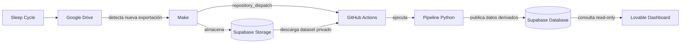

# Sleep Insights

Proyecto end-to-end de análisis de datos personales de sueño construido a partir del historial registrado con **Sleep Cycle**.

El objetivo no es solo visualizar métricas, sino construir un flujo completo y reproducible: **ingesta, validación, limpieza, análisis, automatización, experimentación predictiva, publicación en base de datos y visualización web**.

> Dashboard público: https://sleep-insights-dashboard.lovable.app

---

## ¿Por qué este proyecto?

Uso Sleep Cycle para registrar mi sueño y descubrí que podía trabajar con mi historial completo de datos. A partir de ahí decidí convertirlo en un proyecto personal de Data Science y Data Engineering.

El proyecto evolucionó desde una auditoría local del dataset hasta un pipeline automatizado capaz de detectar nuevas versiones del historial, validar y limpiar los datos, generar métricas y datasets analíticos, actualizar Supabase, alimentar un dashboard público y experimentar con modelos predictivos sin forzar Machine Learning cuando no aporta una mejora clara.

---

## Arquitectura



### Flujo automatizado

1. **Sleep Cycle → Google Drive**  
   Una nueva exportación del historial se guarda en Google Drive.

2. **Google Drive → Make**  
   Make detecta el nuevo archivo.

3. **Make → Supabase Storage**  
   El dataset original se almacena en un bucket privado.

4. **Make → GitHub Actions**  
   Make dispara el workflow mediante `repository_dispatch`.

5. **GitHub Actions → Supabase Storage**  
   El workflow descarga el dataset privado y valida que la versión recibida sea correcta.

6. **GitHub Actions → Python**  
   Se ejecuta el pipeline de procesamiento y análisis.

7. **Python → Supabase**  
   Los resultados derivados se publican en las tablas utilizadas por el frontend.

8. **Supabase → Dashboard**  
   El dashboard consulta únicamente los datos necesarios para las visualizaciones.

---

## Pipeline de datos

El pipeline de producción está orquestado por `src/run_sleep_pipeline.py`.

Sus principales etapas son:

1. **Auditoría del dataset**
   - estructura y columnas;
   - fechas y duraciones;
   - duplicados;
   - valores inválidos;
   - sesiones anómalas.

2. **Limpieza**
   - normalización de tipos;
   - validación de sesiones;
   - exclusión de registros no válidos para análisis;
   - conservación de trazabilidad mediante informes.

3. **Análisis**
   - métricas generales;
   - agregaciones semanales y mensuales;
   - análisis por día de la semana;
   - etiquetas y notas;
   - factores asociados con la calidad del sueño;
   - distribuciones.

4. **Preparación del dashboard**
   - generación de datasets derivados optimizados para visualización;
   - mantenimiento de días sin datos como huecos reales;
   - sin interpolar registros inexistentes.

5. **Predicción**
   - preparación del histórico;
   - cálculo de frecuencia por rango de duración;
   - generación de la estimación utilizada actualmente por el dashboard.

6. **Carga y verificación**
   - actualización de Supabase;
   - comprobación de que los datos publicados corresponden a la última versión procesada.

---

## Métricas y análisis

El dashboard incluye, entre otras, las siguientes métricas:

- calidad del sueño;
- duración del sueño;
- tiempo en cama;
- eficiencia del sueño;
- latencia del sueño;
- regularidad;
- evolución diaria, semanal y mensual;
- patrones por día de la semana;
- asociaciones con notas y hábitos;
- factores relacionados con la calidad;
- distribuciones y comparaciones temporales.

Los días sin registro se mantienen como ausencia de datos. El pipeline no inventa ni interpola sesiones.

---

## Predicción: por qué no forcé Machine Learning

La primera formulación del problema fue intentar predecir la **duración exacta del sueño** de una noche futura.

Se probaron distintos enfoques, entre ellos:

- historical mean como baseline;
- Ridge Regression;
- Random Forest;
- HistGradientBoosting;
- validación temporal;
- validación purgada para reducir riesgo de leakage.

Los experimentos mostraron que los modelos más complejos **no mejoraban de forma suficientemente robusta al baseline histórico sobre datos futuros**.

En lugar de desplegar un modelo más sofisticado solo por utilizar Machine Learning, el problema se reformuló.

### Enfoque actual de producción

Cada noche histórica se clasifica en uno de tres rangos:

| Rango | Definición |
|---|---|
| Corto | `< 6 h` |
| Medio | `6–8 h` |
| Largo | `> 8 h` |

La aplicación calcula la **frecuencia histórica** de cada rango y muestra el más frecuente junto con su porcentaje observado.

Por tanto, la predicción actual es una **estimación estadística basada en el histórico**, no un modelo de Machine Learning.

Los experimentos anteriores se conservan en `experiments/forecasting/` porque forman parte del proceso metodológico del proyecto.

---

## Automatización y controles de integridad

El procesamiento no depende de ejecutar scripts manualmente.

El workflow de GitHub Actions:

- recibe el evento enviado por Make;
- valida la ruta del objeto recibido;
- descarga el dataset desde Storage;
- comprueba la estructura del archivo;
- ejecuta el pipeline;
- aplica protección frente a datasets antiguos o incompletos;
- actualiza las tablas derivadas;
- verifica que Supabase contiene la nueva versión.

Esto evita que una exportación anterior o incompleta sustituya accidentalmente los datos más recientes.

---

## Seguridad y privacidad

El repositorio está diseñado para poder publicarse sin incluir los datos personales originales ni credenciales.

- El dataset completo no se versiona en Git.
- `.env` está excluido mediante `.gitignore`.
- Las credenciales se almacenan como secretos de entorno/GitHub Actions.
- Supabase Storage permanece privado.
- El frontend no contiene claves de backend.
- Las tablas públicas utilizadas por el dashboard tienen acceso de solo lectura.
- Los datasets, modelos y reportes generados localmente no forman parte del repositorio.
- Antes de publicar el proyecto se revisó el historial de Git y los logs de GitHub Actions con herramientas de detección de secretos.

> En el futuro se puede añadir un dataset reducido y anonimizado exclusivamente como muestra reproducible del proyecto.

---

## Estructura del repositorio

```text
SLEEP_PROYECT/
│
├── .github/
│   └── workflows/
│       └── sleep-pipeline.yml
│
├── src/
│   ├── analyze_sleep_data.py
│   ├── audit_sleep_data.py
│   ├── build_sleep_type_prediction.py
│   ├── clean_sleep_data.py
│   ├── load_dashboard_to_supabase.py
│   ├── load_sleep_type_prediction_to_supabase.py
│   ├── prepare_dashboard_data.py
│   ├── prepare_prediction_dataset.py
│   └── run_sleep_pipeline.py
│
├── experiments/
│   └── forecasting/
│       ├── audit_prediction_data.py
│       ├── audit_short_sleep_target.py
│       ├── build_production_sleep_forecast.py
│       ├── evaluate_prediction_baselines.py
│       ├── evaluate_short_sleep_models.py
│       ├── load_sleep_forecast_to_supabase.py
│       ├── train_prediction_models.py
│       └── validate_prediction_models_purged.py
│
├── .env.example
├── .gitattributes
├── .gitignore
├── README.md
└── requirements.txt
```

`data/`, `reports/`, `models/`, `.env` y el entorno virtual se generan o mantienen localmente y no se versionan.

---

## Ejecución local

### 1. Clonar el repositorio

```bash
git clone <URL_DEL_REPOSITORIO>
cd SLEEP_PROYECT
```

### 2. Crear un entorno virtual

#### Windows PowerShell

```powershell
python -m venv .venv
Set-ExecutionPolicy -Scope Process -ExecutionPolicy Bypass
.\.venv\Scripts\Activate.ps1
python -m pip install --upgrade pip
pip install -r requirements.txt
```

#### macOS / Linux

```bash
python3 -m venv .venv
source .venv/bin/activate
python -m pip install --upgrade pip
pip install -r requirements.txt
```

### 3. Configurar variables de entorno

```bash
cp .env.example .env
```

En Windows:

```powershell
Copy-Item .env.example .env
```

Completa únicamente los valores necesarios en `.env`. Nunca subas `.env` al repositorio.

### 4. Añadir el dataset local

El dataset personal original no está incluido. La ejecución local trabaja con los datos dentro de:

```text
data/raw/
```

### 5. Ejecutar el pipeline sin publicar en base de datos

```bash
python src/run_sleep_pipeline.py --skip-db
```

Esto permite ejecutar las fases de procesamiento y generar los resultados locales sin escribir en Supabase.

---

## Tecnologías

| Área | Tecnologías |
|---|---|
| Análisis y procesamiento | Python, Pandas, NumPy |
| Experimentación predictiva | scikit-learn |
| Base de datos y Storage | PostgreSQL, Supabase |
| Automatización | GitHub Actions, Make |
| Ingesta | Google Drive |
| Frontend | Lovable |
| Control de versiones | Git, GitHub |

---

## Decisiones metodológicas

Este proyecto prioriza:

- reproducibilidad;
- validación temporal;
- separación entre producción y experimentación;
- trazabilidad de registros excluidos;
- ausencia de interpolación artificial;
- comparación contra baselines;
- simplicidad cuando la complejidad no aporta una mejora demostrable;
- automatización con controles de integridad;
- separación entre datos privados y resultados públicos.

---

## Estado del proyecto

El pipeline está automatizado y el dashboard se actualiza a partir de nuevas versiones del historial.

La arquitectura actual separa claramente:

- **producción**, en `src/`;
- **experimentos**, en `experiments/forecasting/`;
- **datos personales y resultados generados**, fuera del control de versiones.

---

## Dashboard

Puedes explorar el resultado final aquí:

**https://sleep-insights-dashboard.lovable.app**

El dashboard incluye:

- resumen general;
- evolución temporal;
- hábitos;
- factores asociados;
- estimación del rango de sueño de la próxima noche;
- metodología del proyecto.

---

## Nota

Este proyecto utiliza datos personales con fines de aprendizaje y portfolio. Las relaciones mostradas en el dashboard son descriptivas y no deben interpretarse como conclusiones médicas ni causales.
